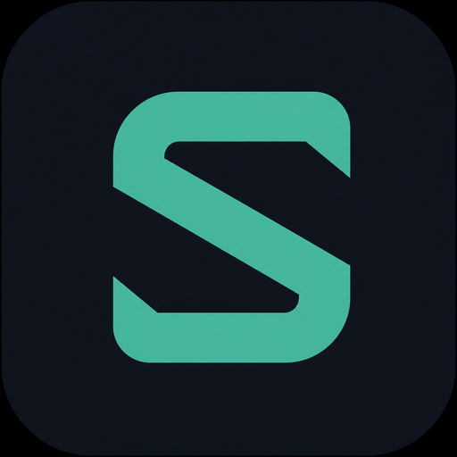

<p align="center">
  
</p>

<h1 align="center">Schinza</h1>

<p align="center">
  <a href="./README.md">English</a> · <a href="./README.zh-CN.md"><b>中文</b></a>
</p>

<p align="center">
  <strong>微信公众号凭证与历史文章 Windows 桌面助手</strong>
  <br />
  捕获短暂客户端密钥 · 管理 30 分钟有效期 · 拉取近 7 / 30 / 90 天历史 · 列表与正文多格式导出（HTML / Markdown / TXT / JSON）
</p>

<p align="center">
  <a href="https://github.com/Alexxxxxxxxxxxxy/schinza-wechat-certificate/releases"></a>
  <a href="#开源协议"></a>
  <a href="#运行环境"></a>
  <a href="#运行环境"></a>
  
</p>

<p align="center">
  <b><a href="https://github.com/Alexxxxxxxxxxxxy/schinza-wechat-certificate/releases">⬇ 下载最新发行版</a></b>
</p>

---

## 下载

预编译 Windows 包（onedir）发布在 GitHub Releases：

**https://github.com/Alexxxxxxxxxxxxy/schinza-wechat-certificate/releases**

1. 打开最新 Release（如 `schinza:1.2.1`）
2. 下载压缩包并解压**整个** `Schinza` 文件夹
3. 运行 `Schinza.exe`（请勿只拷贝单个 `.exe`，需保留 `_internal/` 等依赖）

源码仓库：[Alexxxxxxxxxxxxy/schinza-wechat-certificate](https://github.com/Alexxxxxxxxxxxxy/schinza-wechat-certificate)

---

## 项目简介

**Schinza** 是一款开源 Windows 桌面工具，在本机完成公众号凭证与历史文章相关操作：

| 模块 | 功能 |
|------|------|
| **凭证管理** | 安装随包 MITM CA、启动本地代理，从微信桌面捕获 `__biz` / `uin` / `key` / `pass_ticket`；每套凭证 **30 分钟**有效，支持续约 / 复制 JSON |
| **历史文章** | 经 `profile_ext?action=getmsg` 拉取 **近 7 / 30 / 90 天**列表；微信漏掉同日后续推送时，可用抓包目击或 **补录链接** 合并 |
| **列表导出** | JSON · CSV（Excel）· TSV · Markdown · 纯链接 · 标题+链接 |
| **正文导出** | 单篇 **HTML**（保留微信排版）· **Markdown** · **TXT** · **JSON** |

所有凭证与导出仅保存在本机 `data/`，应用不会上传数据。

---

## 界面说明

左侧栏切换（深色 slate + 绿色强调）：

1. **凭证管理** — 安装 CA、代理、添加并抓包、倒计时卡片  
2. **历史文章** — 选择公众号 · 时间范围 · 拉取 · 补录 · 浏览 · 导出  

---

## 运行环境

- Windows 10 / 11（x64）
- 微信**桌面版**（用于凭证捕获）
- Python **3.11+**（开发 / 打包）
- 打包时需要 Python/conda 环境中的 OpenSSL DLL（`libssl` / `libcrypto`）

---

## 快速开始（源码）

```powershell
git clone https://github.com/Alexxxxxxxxxxxxy/schinza-wechat-certificate.git
cd schinza-wechat-certificate

python -m venv .venv
.\.venv\Scripts\Activate.ps1
pip install -r requirements.txt

# 可选：复制完整 mitmproxy CA（含私钥）用于抓包/打包
# 推荐：%USERPROFILE%\.mitmproxy\mitmproxy-ca.pem

python main.py
```

### 首次抓包流程

1. **凭证管理** → **安装 CA 证书** → **重启微信桌面**  
2. 填写公众号名称 + 任意文章链接 → **添加并抓包**  
3. 在微信桌面打开该公众号任意一篇文章  
4. 卡片出现凭证（30 分钟）。过期后点 **续约**  
5. **历史文章** → 选择 7 / 30 / 90 天 → **拉取** → 导出列表或单篇正文  

> 请优先「添加并抓包」。若 getmsg 漏掉同日文章，可在抓包开启时点开该文，或使用「补录链接」。

---

## 打包 Windows 发行版

```powershell
.\build.ps1
```

```text
dist\Schinza\Schinza.exe
```

请分发**整个** `dist\Schinza` 文件夹。构建可抓包二进制需要带私钥的 CA — **切勿将私钥提交到公开仓库**。

---

## 目录结构

```text
├── assets/
├── app/
│   ├── ui.py                 # CustomTkinter 界面
│   ├── mitm_capture.py       # 进程内 mitmproxy
│   ├── mitm_addon.py         # 凭证 + 文章目击
│   ├── history_client.py     # getmsg + 补录合并
│   ├── history_ranges.py     # 7 / 30 / 90 天
│   ├── history_export.py     # 列表导出
│   ├── article_reader.py     # 正文 HTML / MD / TXT / JSON
│   ├── sightings.py          # 补录 / 抓包目击存储
│   ├── credentials.py
│   ├── store.py
│   └── ca_setup.py
├── tests/
├── main.py
├── build.ps1
├── requirements.txt
├── LICENSE
├── README.md
└── README.zh-CN.md
```

---

## 导出格式

**历史列表：** JSON · CSV · TSV · Markdown · 纯链接 · 标题+链接  

**单篇正文：** HTML（规范化微信排版）· Markdown · TXT · JSON  

---

## 安全与使用规范

- 凭证短时有效，仅存本机 `data/accounts.json`  
- 历史拉取绕过系统 MITM 代理（`trust_env=False`）  
- 仅在您有权操作的账号与设备上使用  
- 遵守微信 / 腾讯服务条款及相关法律  
- 勿公开私有 CA 密钥或真实 `uin` / `key` / `pass_ticket`  
- 他人滥用与作者无关（见[免责声明](#免责声明)）

---

## 配置说明

| 项 | 说明 |
|----|------|
| 代理 | 抓包运行时为 `127.0.0.1:8088` |
| 有效期 | 每套凭证 30 分钟 |
| 历史窗口 | 近 7 / 30 / 90 天 |
| getmsg 接口 | `https://mp.weixin.qq.com/mp/profile_ext?action=getmsg` |
| 发行版下载 | https://github.com/Alexxxxxxxxxxxxy/schinza-wechat-certificate/releases |

---

## 开发

```powershell
.\.venv\Scripts\Activate.ps1
python -m pip install -r requirements.txt
python main.py
```

欢迎 PR。请勿提交 `data/*.json`、`dist/`、`.venv/` 或 CA 私钥。

---

## 开源协议

本项目基于 [MIT License](LICENSE) 开源。

```text
Copyright (c) 2026 Schinza Contributors
```

---

## 免责声明

本项目**仅作为开源软件**提供，供学习、研究与合法自用参考。

- 下载、复制、修改或使用即视为已了解风险，并**自行承担全部责任与后果**。
- 作者及贡献者**不对**因使用或滥用导致的损失、封禁、纠纷、泄露等承担责任。
- **其他人实施的危险、滥用、违法或违规行为，与作者无关。**
- Schinza **与**腾讯或微信**无关联、背书或赞助关系**。

**若不同意以上声明，请勿使用本软件。**

---

<p align="center">
  <a href="https://github.com/Alexxxxxxxxxxxxy/schinza-wechat-certificate/releases"><b>下载</b></a>
  ·
  <a href="./README.md">English</a>
  ·
  <a href="./README.zh-CN.md"><b>中文</b></a>
</p>
